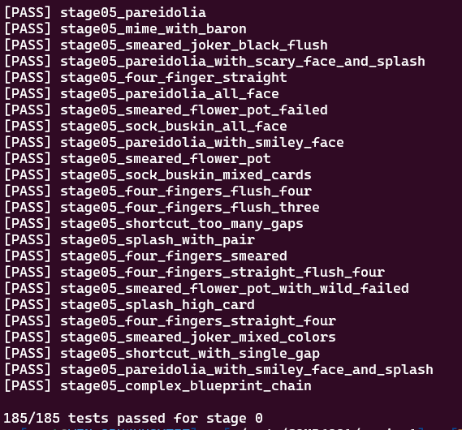

# Ortalab Scoring System (COMP6991 Assignment 1)

🎴 This repository documents the full solution design and testing results for the **COMP6991 Assignment 1 - Ortalab**, a poker-inspired scoring system implemented in **Rust**.

> ❗ **Note:** Source code is not publicly available due to academic integrity concerns. If you're working on a similar assignment and need help understanding the logic or building your own solution, feel free to contact me.

---

## 🧠 Project Summary

This assignment simulates a complex scoring system involving:
- Standard poker hand detection (Pair, Two Pair, Flush, Straight, etc.)
- Card **Enhancements**: `Bonus`, `Mult`, `Glass`, `Steel`, `Wild`
- Card **Editions**: `Foil`, `Holographic`, `Polychrome`
- **Joker effects** (Easy, Medium, Hard tiers), including:
  - Chainable and retriggerable effects
  - Conditional logic based on game state
  - Multiplicative and additive chip modifiers

The implementation is:
- **Modular and extensible**: Cleanly separated modules for Cards, Jokers, Enhancements, Editions, and Game Logic
- **Test-driven**: All stages passed with full test coverage
- **Trait-oriented**: Joker logic is abstracted via `JokerEffect` trait, supporting composability and clean chaining

---

## ✅ Full Test Pass Proof

All stages passed successfully. Below is a screenshot as proof:

> *(Please refer to the screenshot above for confirmation of full functionality and test completion.)*

---

## 💬 Need Help?

If you're stuck with the Ortalab assignment or want a walkthrough of how to approach it using idiomatic Rust and modular design, you're welcome to reach out.

📱 **Contact via WeChat: `coder199608`**

*Serious inquiries only. No direct code sharing – but I'm happy to help you understand and build your own!*

---

## ⚠️ Disclaimer

This repository **does not contain** the source code to maintain academic fairness. All rights reserved. Sharing or using assignment solutions directly is a violation of most university academic honesty policies.

---

## 📚 Tags

`Rust` `COMP6991` `Ortalab` `Poker Scoring` `Game Dev` `Trait` `Modular Design` `University Assignment`
